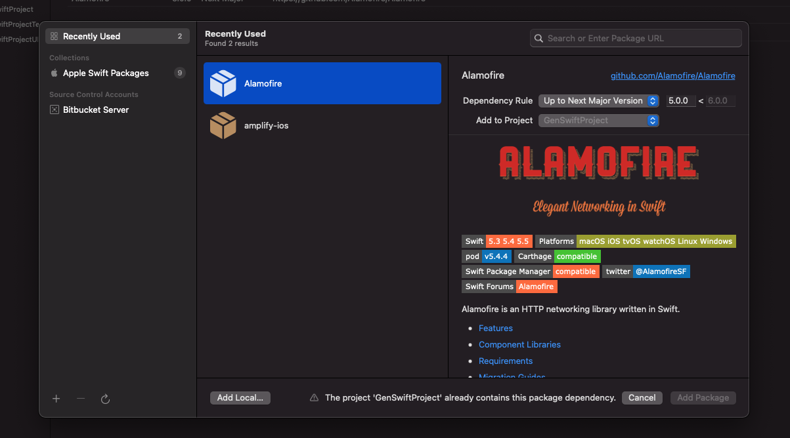
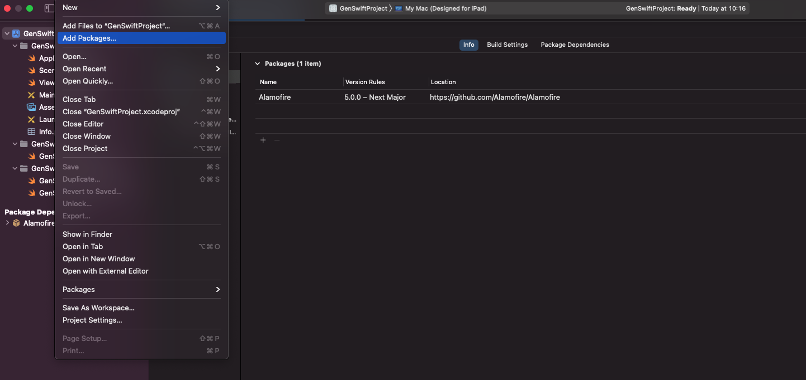

# SwiftExampleAppWithSPM
A Swift example App using SPM (using Storyboard no SwiftUI)

## How to use ?
I added Alamofire as an example to illustrate how SPM works for iOS Apps.

To add another package go to :

1. File -> Add Packages -> Paste the url of your package

2. Click add package

3. You can now import your package.

## More :

With SPM no need to install anything and no need to run anything
